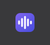
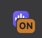
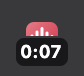
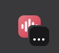

<p align="center"></p>

<h1 align="center">Tab Audio Recorder</h1>

<p align="center">
  A Chrome extension that records the audio playing in a tab and saves it as an M4A.<br>
  Works on any site, even ones without a download button.
</p>

<p align="center">
  <a href="https://github.com/DracoLi/tab-audio-recorder/releases/latest"></a>
  <a href="LICENSE"></a>
</p>

Tab Audio Recorder captures sound directly from a browser tab, not through the microphone, and saves it to your Downloads folder. It runs entirely on your computer and requires no account. It works in Chrome, Brave, Edge, Arc, Opera, Vivaldi, and other Chromium browsers.

## Install

The extension isn't on the Chrome Web Store yet, so it's installed manually. This takes a couple of minutes.

1. [Download the zip](https://github.com/DracoLi/tab-audio-recorder/releases/latest/download/tab-audio-recorder.zip) and unzip it. On Windows, right-click the file and choose **Extract All**.
2. Move the `tab-audio-recorder` folder somewhere permanent, such as Documents. The browser loads the extension from this folder.
3. Open `chrome://extensions` in the address bar. Use `brave://extensions` in Brave and `edge://extensions` in Edge.
4. Turn on **Developer mode**.
5. Click **Load unpacked** and select the `tab-audio-recorder` folder.
6. Click the puzzle piece icon in the toolbar and pin **Tab Audio Recorder**.

If the browser reports that the manifest file is missing, select the folder that contains `manifest.json` directly.

### Updating

Replace the contents of the `tab-audio-recorder` folder with the files from the new release, then click the reload icon on the extension's card. To be notified of new versions, watch this repository's releases.

## Usage

1. Open the tab you want to record and click the extension icon.
2. Play the audio. Recording begins when sound is detected, so the file doesn't start with silence.
3. Click the icon again to stop. The file is saved to your Downloads folder and named after the tab, for example `Song Title - YouTube 2026-10-07 14.30.05.m4a`.

The toolbar icon shows the current state:

|  |  |  |  |
| :-: | :-: | :-: | :-: |
| Ready | Waiting for sound | Recording | Saving |

### Notes

- Only the selected tab is recorded. Other tabs, the microphone, and system sounds are not included.
- You can switch tabs during a recording and stop it from any tab.
- System volume does not affect the recording, so you can mute your speakers. The site's own volume control does.
- Closing the recorded tab stops the recording and saves it.
- Browser pages such as settings and the extensions page can't be recorded. The icon shows a red **!** if you try.

## FAQ

### Can I save as MP3?

Recordings are saved as M4A (AAC, 256 kbps, about 2 MB per minute), which plays on almost any device. Use an audio converter if you need MP3.

### Does it work in Firefox or Safari?

No. Neither browser allows extensions to capture a tab's audio.

### Does it work on Netflix, Spotify, and other protected sites?

Not always. Sites that protect their audio may produce a silent recording.

### Is it safe?

The extension makes no network requests, and its source is about 200 lines in [`extension/`](extension). It requests four permissions, none of which show a warning at install:

- `activeTab` and `tabCapture`: capture the tab you clicked and read its title for the file name.
- `offscreen`: run the recorder in a hidden page, since extension service workers can't record audio.
- `downloads`: save the file.

### Am I allowed to record this?

It depends on the content, your local laws, and the site's terms. Only record content you have the right to record. You are responsible for how you use the extension.

## How it works

When you click the icon, the extension gets the tab's audio stream through the [`tabCapture`](https://developer.chrome.com/docs/extensions/reference/api/tabCapture) API and passes it to an [offscreen document](https://developer.chrome.com/docs/extensions/reference/api/offscreen). Capturing a tab mutes it, so the offscreen document plays the stream back through Web Audio while monitoring the level. When sound is detected, a [`MediaRecorder`](https://developer.mozilla.org/docs/Web/API/MediaRecorder) starts encoding AAC. The recorder receives the audio through a 250 ms delay so the start of the first sound isn't clipped. Browsers without an AAC encoder record WebM (Opus) instead.

## Development

The extension is plain JavaScript with no build step. Load [`extension/`](extension) with **Load unpacked**, and click the reload icon on its card after making changes.

```sh
npm install
npx playwright install chromium
npm test                # records a test tone in a tab and verifies the saved file
assets/build-icons.sh   # regenerates the icons from the SVGs (requires librsvg and ImageMagick)
```

To run the test in another Chromium browser, pass its executable path, for example `npm test -- "/Applications/Brave Browser.app/Contents/MacOS/Brave Browser"`.

To publish a release, update the version in [`extension/manifest.json`](extension/manifest.json), add an entry to [`CHANGELOG.md`](CHANGELOG.md), and push a matching tag such as `v1.0.1`. The [release workflow](.github/workflows/release.yml) builds the zip and attaches it to a GitHub release.

## Contributing

Issues and pull requests are welcome. The extension intentionally does one thing, so proposals for new settings or options are unlikely to be accepted.

## License

[MIT](LICENSE)
